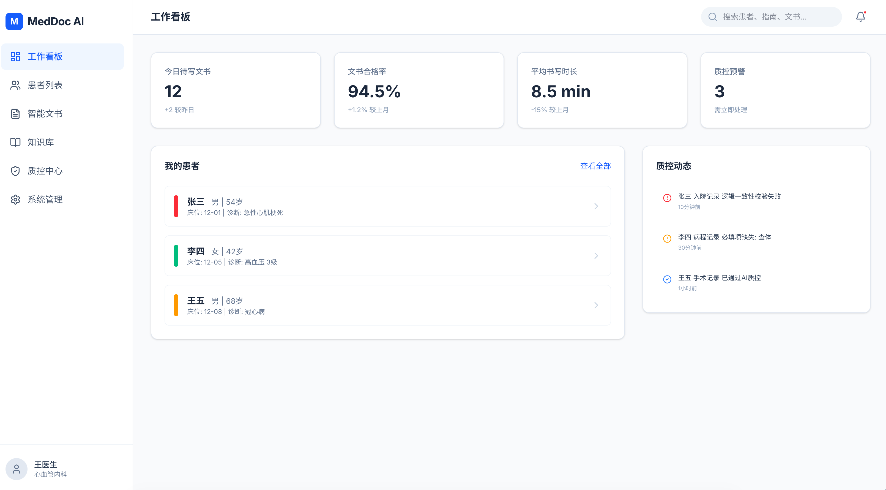

  

<h1 align="center">MedDoc AI</h1>

  <strong>WRITE · REVIEW · APPROVE</strong> 
  AI 驱动的医疗文书智能化管理平台

  
  &nbsp;
  

  
  

 

---

## ✨ 产品简介

**MedDoc AI —— 医疗文书智能化管理平台**

MedDoc AI 是一款专为临床医生打造的 AI 驱动医疗文书管理平台，致力于提升医院文书效率与质量。平台以直观的工作看板为核心，实时呈现待写文书数量、文书合格率、平均书写时长及质控预警等关键指标，让医生对工作全局了然于胸。

通过**智能文书编辑器**，医生可基于患者信息快速生成规范化病历，大幅缩短文书时间。配套的**临床知识库**整合了权威指南、标准规范与专业术语体系，确保文书内容有据可依。

**质控中心**则引入 AI 自动审核机制，实时检测文书中的逻辑冲突（如诊断与用药不匹配），全院文书合格率可达 **92% 以上**，有效降低医疗风险。

MedDoc AI 让医生从繁琐文书工作中解放出来，专注于患者诊疗，真正实现"**AI 赋能，智慧医疗**"。

 

## 🎬 产品截图

  
   
  <b>AI 驱动的医疗文书智能化管理平台</b>

 

## 🪐 立即体验

**🌐 官网体验：[meddoc-ai-platform-preview.vercel.app](https://meddoc-ai-platform-preview.vercel.app/)**

无需安装 · 网页直达

 

## 🛸 关于 Innate Labs

> **Building AI-native products & agents for the next generation of founders.**

[Innate Labs](https://github.com/Innate-Labs) 致力于打造下一代 AI 原生产品与智能体（Agents）。

- 🌐 GitHub：<https://github.com/Innate-Labs>
- 🪐 产品官网：<https://meddoc-ai-platform-preview.vercel.app/>

 

---

  
    © 2026 <a href="https://github.com/Innate-Labs"><b>Innate Labs</b></a> &nbsp;·&nbsp;
    Crafted with 🌊 and ✨ AI &nbsp;·&nbsp;
    <a href="https://meddoc-ai-platform-preview.vercel.app/">meddoc-ai-platform-preview.vercel.app</a>
  

